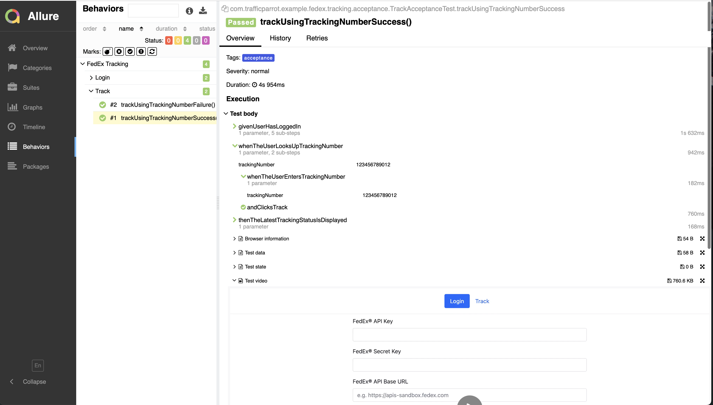

# Traffic Parrot FedEx® Tracking Demo Application
## Requirements
- Register for a [FedEx® API key](https://developer.fedex.com/api/en-us/catalog.html) for the test environment 
- Set up a new `passwords.properties` file with a line like `apikey=password` using your FedEx test API credentials for `https://apis-sandbox.fedex.com`
- Put the corresponding API key name in `FedExApiUsers.FED_EX_API_USER`
- Run the Maven build using `./mvnw clean install`
- See the test run report `target/allure-report/index.html` in your browser:
  
- See the [Integration Guide](https://trafficparrot.com/sandbox-ready-made-mocks/fedex/fedex-integration-guide.html) for more help on how to integrate with the FedEx® Track API 