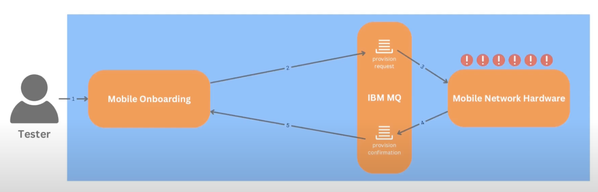
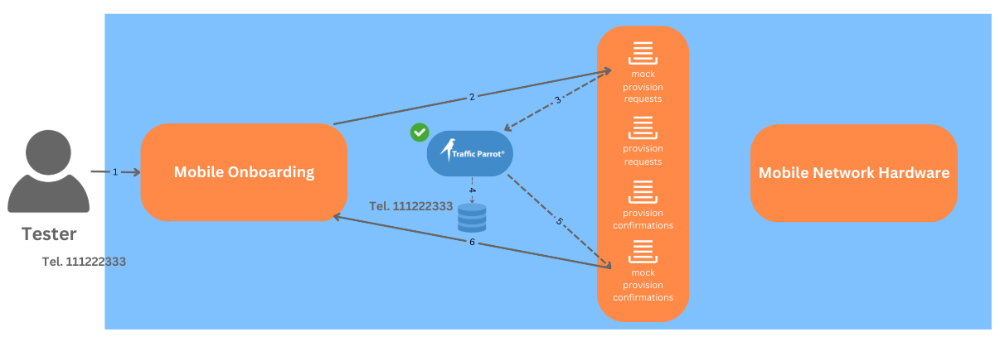
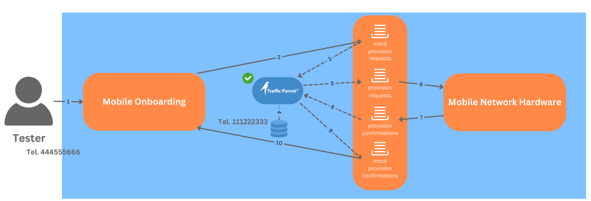

# This is a sample application used for demonstrating how to create passthrough JMS IBM MQ mocks in Traffic Parrot

## Video tutorial

You can find a video version of this tutorial here: https://youtu.be/F_2stfDon2M

[](https://youtu.be/F_2stfDon2M)

## Problem
The ```mobile-onboarding``` application communicates with the ```mobile-network-hardware``` application via IBM MQ request-response queues.

The ```mobile-network-hardware``` application has issues with uptime and availability that result in inconsistent test results when testing the ```mobile-onboarding``` application.



## Solution using Traffic Parrot
Traffic Parrot can simulate the ```mobile-network-hardware``` application
and create a partially mocked environment for ```mobile-onboarding```.

It can simultaneously handle both mock responses and traffic passthrough to the real backend service.

### Mocking


Use mocking to obtain responses without communicating with the real ```mobile-network-hardware``` application.

### Passthrough


Use passthrough obtain responses from the real ```mobile-network-hardware``` application.

## Download the applications used in this tutorial
You can download the ```mobile-network-hardware``` application here: https://trafficparrot.com/documentation/files/mobile-network-hardware.zip

You can download the ```mobile-onboarding``` application here: https://trafficparrot.com/documentation/files/mobile-onboarding.zip 


## Application setup
In order for this project to work you will have to obtain a file ```com.ibm.mq.allclient.jar```
provided by IBM and copy it to the ```mobile-network-hardware\lib``` directory.
Follow these instructions to obtain that file: https://trafficparrot.com/documentation/5.50.x/jms.html#ibm-mq-libs

## Running an IBM MQ Advanced for Developers container image locally
```bash
mkdir /home/$USER/mnt/docker-mq-9
```
```bash
sudo chown 1001 /home/$USER/mnt/docker-mq-9
```
```bash
docker run --env LICENSE=accept --env MQ_QMGR_NAME=QM1 --env MQ_ADMIN_PASSWORD=passw0rd --env MQ_APP_PASSWORD=passw0rd --volume /home/$USER/mnt/docker-mq-9:/mnt/mqm --publish 1414:1414 --publish 9443:9443 --detach icr.io/ibm-messaging/mq:9.4.1.0-r2
```

## Add queues for this application 
```bash
docker exec -it $(docker ps --filter ancestor=icr.io/ibm-messaging/mq:9.4.1.0-r2 --format "{{.ID}}" | head -n1) /bin/bash
```

```bash
runmqsc QM1
```

```
DEFINE QLOCAL(PROVISION_REQUESTS) LIKE(DEV.QUEUE.1)
SET AUTHREC PROFILE(PROVISION_REQUESTS) OBJTYPE(QUEUE) PRINCIPAL('app') AUTHADD(ALL)
DEFINE QLOCAL(PROVISION_CONFIRMATIONS) LIKE(DEV.QUEUE.1)
SET AUTHREC PROFILE(PROVISION_CONFIRMATIONS) OBJTYPE(QUEUE) PRINCIPAL('app') AUTHADD(ALL)
END
```

```bash
exit
```

## To use Traffic Parrot as a partial passthrough/proxy JMS IBM MQ mock:

* Make sure IBM MQ is running and the real queues are set up (see instructions above)
  * Set up mock queues:
      ```bash
      docker exec -it $(docker ps --filter ancestor=icr.io/ibm-messaging/mq:9.4.1.0-r2 --format "{{.ID}}" | head -n1) /bin/bash
      ```
      ```bash
      runmqsc QM1
      ```
      ``` 
      DEFINE QLOCAL(MOCK_PROVISION_REQUESTS) LIKE(DEV.QUEUE.1)
      SET AUTHREC PROFILE(MOCK_PROVISION_REQUESTS) OBJTYPE(QUEUE) PRINCIPAL('app') AUTHADD(ALL)
      DEFINE QLOCAL(MOCK_PROVISION_CONFIRMATIONS) LIKE(DEV.QUEUE.1)
      SET AUTHREC PROFILE(MOCK_PROVISION_CONFIRMATIONS) OBJTYPE(QUEUE) PRINCIPAL('app') AUTHADD(ALL)
      END
      ```
      ```bash
      exit
      ```
* Follow these instructions to install "com.ibm.mq.allclient.jar" in Traffic Parrot https://trafficparrot.com/documentation/5.50.x/jms.html#ibm-mq-libs
* Open ```trafficparrot.properties``` and set property ```trafficparrot.jms.responsetransformers``` value to ```com.trafficparrot.messaging.jms.JmsPassthroughMessage```
* Open ```jms-connections.json``` and set the password on the first connection to ```passw0rd```
* Start Traffic Parrot
* Start both ```mobile-onboarding``` and ```mobile-network-hardware``` applications
* Create a ```mobiles.csv``` file in trafficparrot.x.y.z/data:
  ```csv
  mobileNumber
  111222333
  ```
* Create a JMS mapping in Traffic Parrot
  * Request destination: ```MOCK_PROVISION_REQUESTS```
  * Request priority: ```1```
  * Request matching script:
       ```handlebars
       {{ equal (dataSource '.csv'
       'SELECT mobileNumber
       FROM mobiles.csv
       WHERE mobileNumber = :1'
       (jsonPath request.body '$.mobileNumber')
       single=true
       default=false) (jsonPath request.body '$.mobileNumber') }}
       ```
  * Response destination: ```MOCK_PROVISION_CONFIRMATIONS```
  * Response body:
     ```
     {
      "status": "MOBILE_PROVISIONED",
      "mobileNumber": "{{jsonPath request.body '$.mobileNumber'}}",
      "mobileType": "{{jsonPath request.body '$.mobileType'}}",
      "deviceId": "{{randomUUID}}",
      "date": "{{now format="yyyy-MM-dd'T'HH:mm:ssZ"}}"
     }
    ```
  * Advanced Parameters, Response properties: ```TrafficParrotMockedMessage;java.lang.Boolean;true```
* Create a JMS mapping in Traffic Parrot to passthrough the requests that are mocked to the real service
  * Request destination: ```MOCK_PROVISION_REQUESTS```
  * Request priority: ```2```
  * Response destination: ```PROVISION_REQUESTS```
  * Response transformer: ```JmsPassthroughMessage```
* Create a JMS mapping in Traffic Parrot to passthrough the responses from the real service
  * Request destination: ```PROVISION_CONFIRMATIONS```
  * Response destination: ```MOCK_PROVISION_CONFIRMATIONS```
  * Response transformer: ```JmsPassthroughMessage```
* Turn on JMS replay in Traffic Parrot
* Test the passthrough by sending a few requests from the ```mobile-onboarding``` microservice
