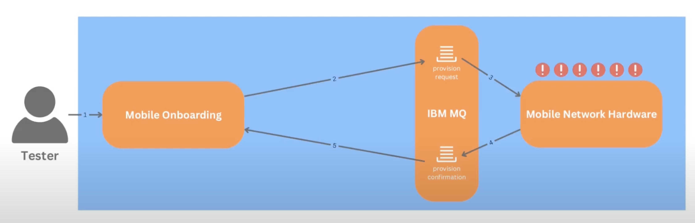
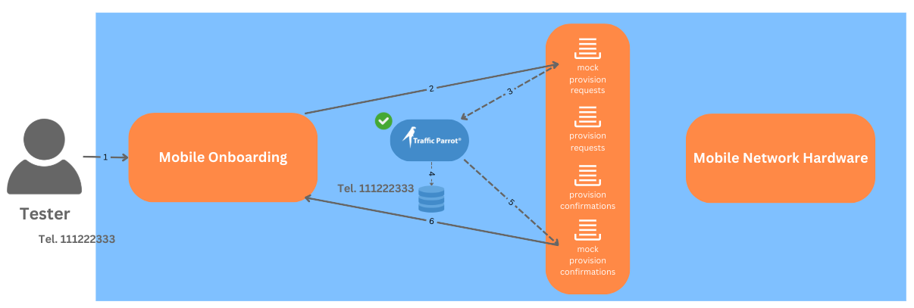
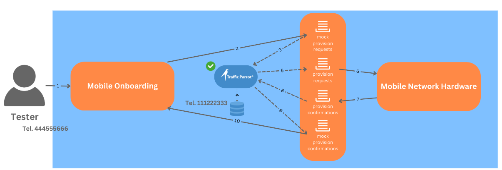

# This is a sample application used for demonstrating how to create passthrough JMS IBM MQ mocks in Traffic Parrot

## Video tutorial

You can find a video version of this tutorial here: https://youtu.be/F_2stfDon2M

[](https://youtu.be/F_2stfDon2M)

## Problem
The ```mobile-onboarding``` application communicates with the ```mobile-network-hardware``` application via IBM MQ request-response queues.

The ```mobile-network-hardware``` application has issues with uptime and availability that result in inconsistent test results when testing the ```mobile-onboarding``` application.



## Solution using Traffic Parrot
Traffic Parrot can simulate the ```mobile-network-hardware``` application
and create a partially mocked environment for ```mobile-onboarding```.

It can simultaneously handle both mock responses and traffic passthrough to the real backend service.

### Mocking


Use mocking to obtain responses without communicating with the real ```mobile-network-hardware``` application.

### Passthrough


Use passthrough obtain responses from the real ```mobile-network-hardware``` application.

## Download the applications used in this tutorial
You can download the ```mobile-network-hardware``` application here: https://github.com/trafficparrot/trafficparrot-demo-applications/releases/latest/download/mobile-network-hardware.zip

You can download the ```mobile-onboarding``` application here: https://github.com/trafficparrot/trafficparrot-demo-applications/releases/latest/download/mobile-onboarding.zip

## Application setup
Both applications need Java 17 or later.

Neither zip contains IBM's MQ client, so both applications need it before they will start. It is the same jar Traffic Parrot needs, so download it once and use it in all three places.

Download ```com.ibm.mq.jakarta.client.jar``` from Maven Central: https://repo1.maven.org/maven2/com/ibm/mq/com.ibm.mq.jakarta.client/10.0.0.5/com.ibm.mq.jakarta.client-10.0.0.5.jar

Unzip both applications and save a copy of that file as ```com.ibm.mq.jakarta.client.jar``` in each ```lib``` directory:
* ```mobile-network-hardware/lib/com.ibm.mq.jakarta.client.jar```
* ```mobile-onboarding/lib/com.ibm.mq.jakarta.client.jar```

That is the only file needed. Installing the same jar in Traffic Parrot is covered in the steps below.

## Running an IBM MQ Advanced for Developers container image locally
```bash
mkdir /home/$USER/mnt/docker-mq-9
```
```bash
sudo chown 1001 /home/$USER/mnt/docker-mq-9
```
```bash
docker run --env LICENSE=accept --env MQ_QMGR_NAME=QM1 --env MQ_ADMIN_PASSWORD=passw0rd --env MQ_APP_PASSWORD=passw0rd --volume /home/$USER/mnt/docker-mq-9:/mnt/mqm --publish 1414:1414 --publish 9443:9443 --detach icr.io/ibm-messaging/mq:9.4.1.0-r2
```

## Add queues for this application 
```bash
docker exec -it $(docker ps --filter ancestor=icr.io/ibm-messaging/mq:9.4.1.0-r2 --format "{{.ID}}" | head -n1) /bin/bash
```

```bash
runmqsc QM1
```

```
DEFINE QLOCAL(PROVISION_REQUESTS) LIKE(DEV.QUEUE.1)
SET AUTHREC PROFILE(PROVISION_REQUESTS) OBJTYPE(QUEUE) PRINCIPAL('app') AUTHADD(ALL)
DEFINE QLOCAL(PROVISION_CONFIRMATIONS) LIKE(DEV.QUEUE.1)
SET AUTHREC PROFILE(PROVISION_CONFIRMATIONS) OBJTYPE(QUEUE) PRINCIPAL('app') AUTHADD(ALL)
END
```

```bash
exit
```

## To use Traffic Parrot as a partial passthrough/proxy JMS IBM MQ mock:

* Make sure IBM MQ is running and the real queues are set up (see instructions above)
  * Set up mock queues:
      ```bash
      docker exec -it $(docker ps --filter ancestor=icr.io/ibm-messaging/mq:9.4.1.0-r2 --format "{{.ID}}" | head -n1) /bin/bash
      ```
      ```bash
      runmqsc QM1
      ```
      ``` 
      DEFINE QLOCAL(MOCK_PROVISION_REQUESTS) LIKE(DEV.QUEUE.1)
      SET AUTHREC PROFILE(MOCK_PROVISION_REQUESTS) OBJTYPE(QUEUE) PRINCIPAL('app') AUTHADD(ALL)
      DEFINE QLOCAL(MOCK_PROVISION_CONFIRMATIONS) LIKE(DEV.QUEUE.1)
      SET AUTHREC PROFILE(MOCK_PROVISION_CONFIRMATIONS) OBJTYPE(QUEUE) PRINCIPAL('app') AUTHADD(ALL)
      END
      ```
      ```bash
      exit
      ```
* Install IBM's MQ client in Traffic Parrot by following https://trafficparrot.com/documentation/latest/jms.html#ibm-mq-libs (it is the same ```com.ibm.mq.jakarta.client.jar``` the demo applications use)
* Open ```trafficparrot.properties``` and set property ```trafficparrot.jms.responsetransformers``` value to ```com.trafficparrot.messaging.jms.JmsPassthroughMessage```
* Open ```jms-connections.json``` and set the password on the first connection to ```passw0rd```
* Start Traffic Parrot
* Start both ```mobile-onboarding``` and ```mobile-network-hardware``` applications with ```start.sh``` (```start.cmd``` on Windows) from inside each unzipped directory. ```mobile-onboarding``` sends to ```MOCK_PROVISION_REQUESTS``` and reads ```MOCK_PROVISION_CONFIRMATIONS```, so its traffic goes through Traffic Parrot, which mocks some requests and passes the rest on to the real ```PROVISION_REQUESTS``` and ```PROVISION_CONFIRMATIONS``` queues that ```mobile-network-hardware``` uses
* Create a ```mobiles.csv``` file in trafficparrot.x.y.z/data:
  ```csv
  mobileNumber
  111222333
  ```
* Create a JMS mapping in Traffic Parrot
  * Request destination: ```MOCK_PROVISION_REQUESTS```
  * Request priority: ```1```
  * Request matching script:
       ```handlebars
       {{ equal (dataSource '.csv'
       'SELECT mobileNumber
       FROM mobiles.csv
       WHERE mobileNumber = :1'
       (jsonPath request.body '$.mobileNumber')
       single=true
       default=false) (jsonPath request.body '$.mobileNumber') }}
       ```
  * Response destination: ```MOCK_PROVISION_CONFIRMATIONS```
  * Response body:
     ```
     {
      "status": "MOBILE_PROVISIONED",
      "mobileNumber": "{{jsonPath request.body '$.mobileNumber'}}",
      "mobileType": "{{jsonPath request.body '$.mobileType'}}",
      "deviceId": "{{randomUUID}}",
      "date": "{{now format="yyyy-MM-dd'T'HH:mm:ssZ"}}"
     }
    ```
  * Advanced Parameters, Response properties: ```TrafficParrotMockedMessage;java.lang.Boolean;true```
* Create a JMS mapping in Traffic Parrot to passthrough the requests that are mocked to the real service
  * Request destination: ```MOCK_PROVISION_REQUESTS```
  * Request priority: ```2```
  * Response destination: ```PROVISION_REQUESTS```
  * Response transformer: ```JmsPassthroughMessage```
* Create a JMS mapping in Traffic Parrot to passthrough the responses from the real service
  * Request destination: ```PROVISION_CONFIRMATIONS```
  * Response destination: ```MOCK_PROVISION_CONFIRMATIONS```
  * Response transformer: ```JmsPassthroughMessage```
* Turn on JMS replay in Traffic Parrot
* Test the passthrough by sending a few requests from the ```mobile-onboarding``` web page at http://localhost:8383
