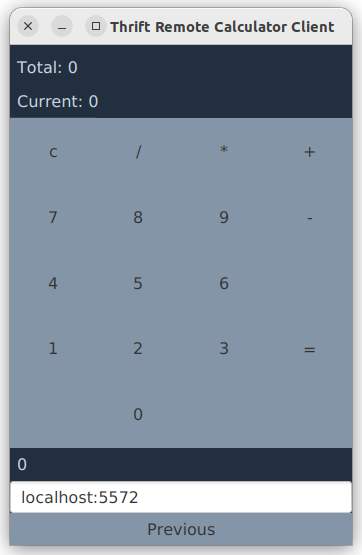

# Demo project for testing Thrift service simulators using Traffic Parrot

You can create [Thrift service/server simulators (also called Thrift API mocks and Thrift service virtualization) using Traffic Parrot](https://trafficparrot.com/documentation/?redirectToLatest=true&path=/thrift.html).
This calculator project is a simple demo that you can use to test Traffic Parrot simulators.

Requirements:
* Install [Thrift](https://thrift.apache.org/docs/install/)
* Java JDK 11+ is required to build and run the demo application since JavaFX is used for the UI
* Java JDK 8+ is required to run Traffic Parrot with Thrift capability
* Download Traffic Parrot (you can [request a trial here](https://trafficparrot.com/trial.html?utm_source=thrift-calculator))

Instructions:
1. ./mvnw clean install
2. unzip thrift-calculator-1.1.0-release.zip
3. cd thrift-calculator-1.1.0/
4. Start the demo server ./start-server.sh
5. Start the demo client ./start-client.sh
6. Unzip Traffic Parrot
7. Copy [shared.thrift](src/main/thrift/shared.thrift) and [tutorial.thrift](src/main/thrift/tutorial.thrift) to the thrift/ folder of Traffic Parrot
8. Place the thrift binary in the plugins/ folder of Traffic Parrot
9. Start Traffic Parrot ./start.sh 
10. Traffic Parrot can now be used to record the real server localhost:5572
11. The client can either talk directly to the real server localhost:5572 or to Traffic Parrot on localhost:5562

[Contact us](https://trafficparrot.com/contact.html?utm_source=thrift-calculator) for more details
