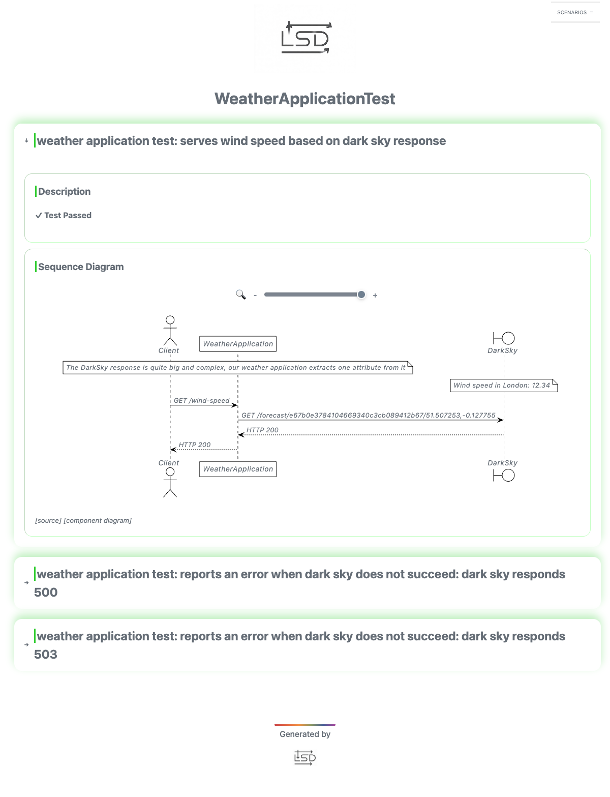

# Weather application with sequence diagrams

The weather application answers `GET /wind-speed` with the wind speed in London, read from the DarkSky forecast API.
Its test stands WireMock in for DarkSky and uses [LSD (Living Sequence Diagrams)](https://github.com/lsd-consulting/lsd-core)
to draw each test's HTTP traffic as a sequence diagram; click an arrow in the report to see the full request or response.

Run the tests with `mvn verify` on Java 21; the report is written to `target/lsd/`. The test needs ports 8080 and 8282 free.

This example used to use YatSpec, which is no longer maintained; the YatSpec fork that drew these diagrams now recommends LSD instead.
